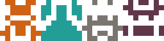

Identigon
=========

This is the smallest identicon library that you have ever seen! Less than 35
lines of code. Small enough that you can look at it and learn how to make one
yourself!



### Installation
```
go get -u github.com/tanema/identigon
```

### Usage

```
import (
  "os"
  "github.com/tanema/identigon"
)


func main() {
  img := identigon.Generate("my username", 80, 8)
  file, _ := os.Open("image.png")
  defer file.Close()
  png.Encode(file, img)
}
```

### CLI
The library comes with a small cli to allow identicon generation on the command
line and allow scripting with it so you can mass generate them as well.

Install the cli with

```
go install github.com/tanema/identigon/cmd/idntcn
```

Then you can run `idntcn --help` to see the full usage of the CLI.


### Micro blog

The inspirations was [this post from github](https://github.blog/2013-08-14-identicons/)

> At Github Our Identicons are simple 5×5 “pixel” sprites that are generated using
> a hash of the user’s ID. The algorithm walks through the hash and turns pixels
> on or off depending on even or odd values. These generated patterns, combined
> with hash-determined color values, ensures a huge number of unique Identicons.

and I was like. Yeah! I could do that on a friday night. So I did!

So this is how I decided to implement it.

```go
// assume size is 80 and pixels is 8
func Generate(data string, size, pixels int) image.Image {
  pix := size / pixels // determine the size of the pixels, in this case 10
  img := image.NewRGBA(image.Rect(0, 0, size, size)) // create an image 80x80
  sum := sha512.Sum512([]byte(data)) // hash the string to get 64 byte values
  pixcolor := color.RGBA{uint8(sum[0]), uint8(sum[1]), uint8(sum[2]), 255} // use the first 3 bytes to make a forground color
  i := 0 // keep track of our position in the hash and what byte we are examining
  // These for loops will loop through the left hand side of the image and we
  // mirror the drawing on both sides
  for y := 0; y < pixels; y++ {
    for x := 0; x < pixels/2; x++ {
      // check if the byte is even. This is done by bitwise and.
      // if the and result is 0 then it is even. We will only draw if the value is even.
      if sum[i%len(sum)]&1 == 0 {
        drawRect(img, x*pix, y*pix, pix, pix, pixcolor) // draw left hand side pixel
        drawRect(img, (pixels-1-x)*pix, y*pix, pix, pix, pixcolor) // draw mirrored right hand side
      }
      i++
    }
  }
  return img
}
```
